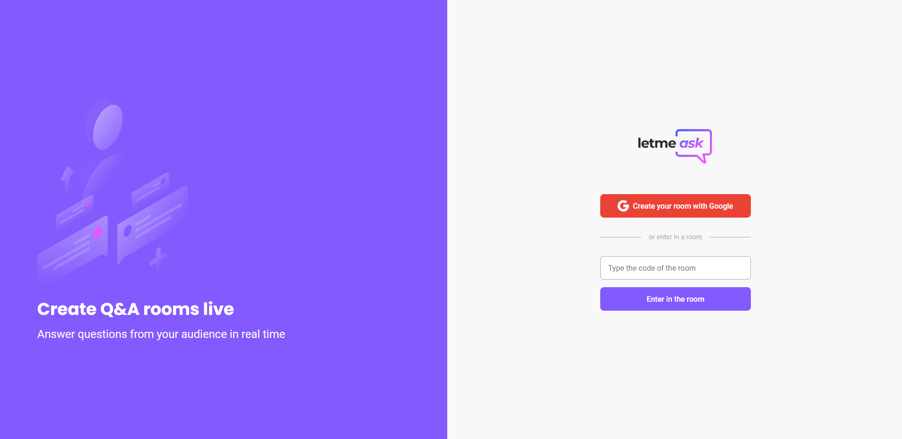
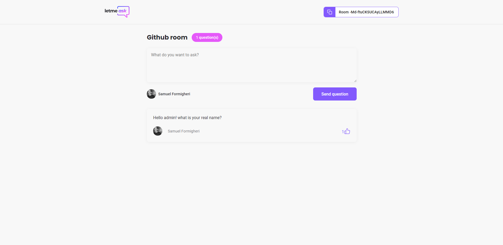

<h1 align="center">
   
</h1>
 

  <a href="#-projeto">Project</a>&nbsp;&nbsp;&nbsp;|&nbsp;&nbsp;&nbsp;
  <a href="#-tecnologias">Technologies</a>&nbsp;&nbsp;&nbsp;|&nbsp;&nbsp;&nbsp;
  <a href="#-usage">Usage</a>&nbsp;&nbsp;&nbsp;|&nbsp;&nbsp;&nbsp;
  <a href="#-participants">Participants</a>

 

## 💻 Project

🔊 LetMeAsk was an app made with React JS. In the application you can create room using Google Authentication, manage them answer questions, give likes... It was developed during @Rocketseat NLW#06.. 💜

    
    

## 🚀 Technologies

This project was developed with the following technologies:

- [React](https://reactjs.org/)
- [Firebase](https://firebase.google.com/)
- [Typescript](https://www.typescriptlang.org/)

## 💻 Usage

 ### App
    
    $ if you want to test you need to create a firebase project 

    $ create a real time database with the following rules:

    {
      "rules": {
        "rooms": {
          ".read": false,
          ".write": "auth != null",
          "$roomId": {
            ".read": true,
            ".write": "auth != null && (!data.exists() || data.child('authorId').val() == auth.id)",
            "questions": {
              ".read": true,
              ".write": "auth != null && (!data.exists() || data.parent().child('authorId').val() == auth.id)",
              "likes": {
                ".read": true,
                ".write": "auth != null && (!data.exists() || data.child('authorId').val() == auth.id)",  
              }
            }
          }
        }
      }
    }

    $ create a .env.local file with the keys according to .env.example and the values was on configuration of the project on the firebase console

    $ yarn to install the dependencies.
    
    $ yarn start
    

## 👥 Participants

[Samuel Formigheri](https://github.com/SamuelFormigheri)